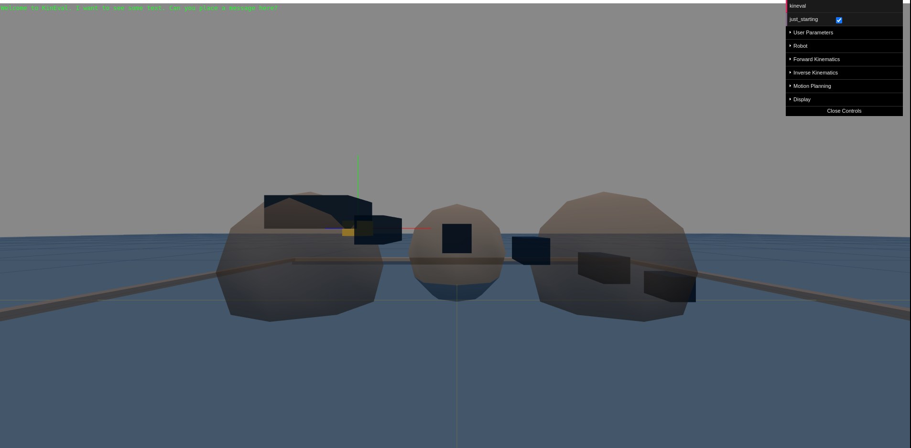
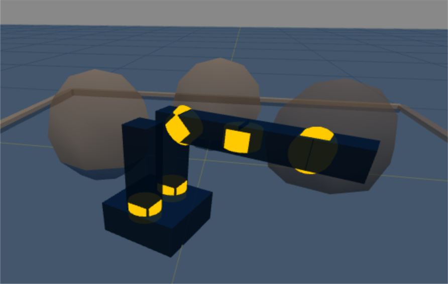
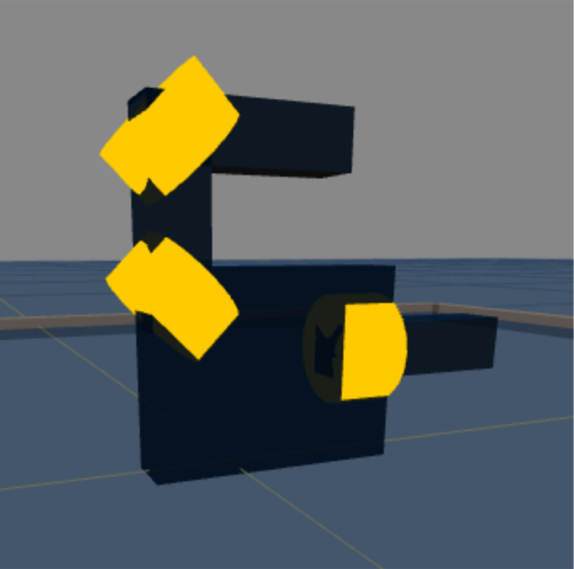
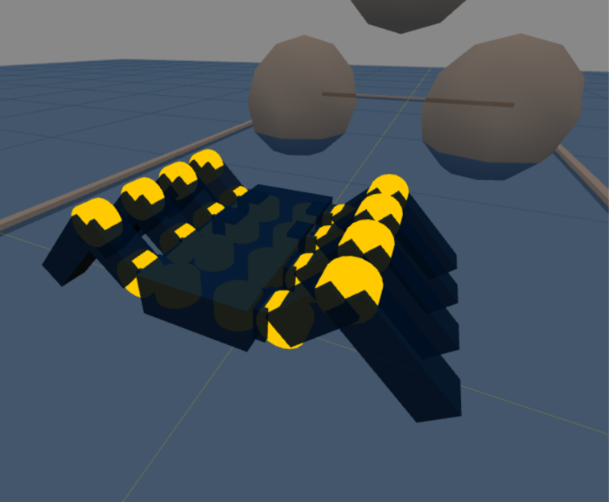
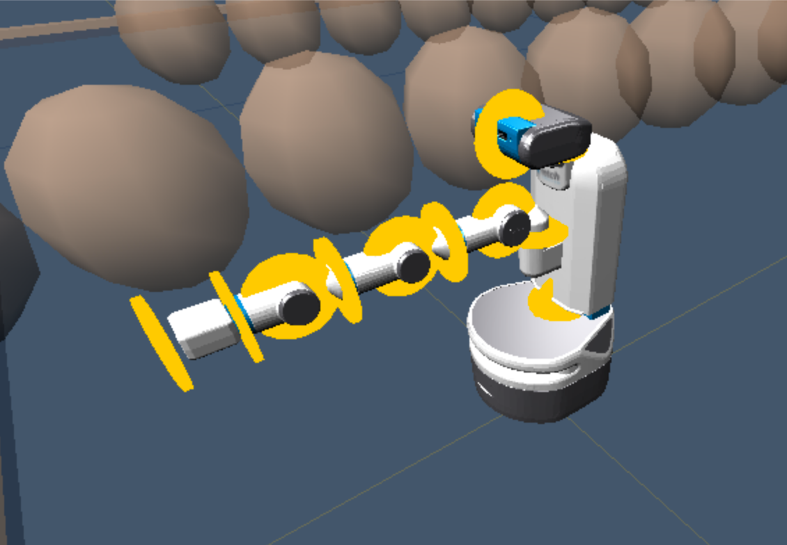
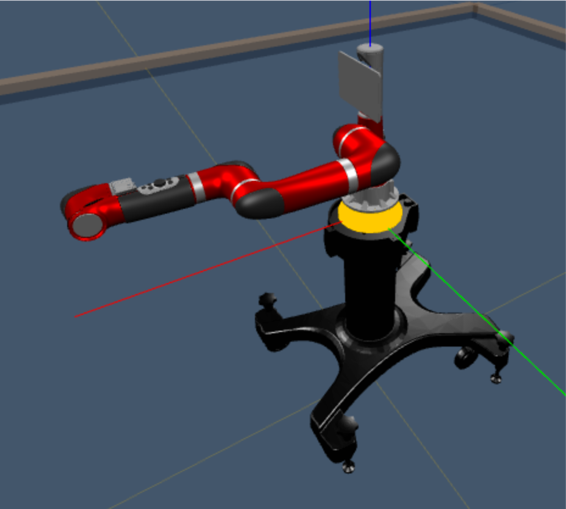

# Assignment 3: Forward Kinematics

### Due 11:59pm, Friday, February 24, 2023

Forward kinematics (FK) forms the core of our ability to purposefully control the motion of a robot arm. FK will provide us a general formulation for controlling any robot arm to reach a desired configuration and execute a desired trajectory. Specifically, FK allows us to predict the spatial layout of the robot in our 3D world given a configuration of its joints. For the purposes of grasping and dexterous tasks, FK gives us the critical ability to predict the location of the robot's gripper (also known as its "endeffector"). As shown in our [IROS 2017](http://www.iros2017.org/) video below, such manipulation assumes a robot has already perceived its environment as a scene estimate of objects and their positions and orientations. Given this scene estimate, a robot controller uses FK to evaluate and execute viable endeffector trajectories for grasping and manipulating an object.

<iframe width="560" height="315" src="https://www.youtube.com/embed/ry0mqY5I-04" frameborder="0" allow="autoplay; encrypted-media" allowfullscreen></iframe>

In this assignment, you will render the forward kinematics of an arbitrary robot, given an arbitrary kinematic specification.  A collection of specifications for various robots is provided in the "robots" subdirectory of the KinEval code stencil.  These robots include the Rethink Robotics' Baxter and Sawyer robots, the Fetch mobile manipulator, and a variety of example test robots, as shown in the "Desired Results" section below.  To render the robot properly, you will compute matrix coordinate frame transforms for each link and joint of the robot based on the parameters of its hierarchy of joint configurations.  The computation of the matrix transform for each joint and link will allow KinEval's rendering support routines to properly display the full robot.  We will assume the joints will remain in their zero position, saving joint motion for the next assignment.  

## Features Overview

This assignment requires the following features to be implemented in the corresponding files in your repository:

- [Optional, recommended] Fill in stencils for Just Starting Mode in "kineval/kineval_startingpoint.js"
- Core matrix routines in "kineval/kineval_matrix.js"
- FK transforms in "kineval/kineval_forward_kinematics.js"
- Joint selection/rendering, based on the kinematic hierarchy in "kineval/kineval_robot_init_joints.js"
- [Grad section only] Base offset transform in "kineval/kineval_forward_kinematics.js" 
- <!-- [Grad section only]  -->New robot definition in your own file in the "robots" directory

Points distributions for these features can be found in the [project rubric section](#project_rubric). More details about each of these features and the implementation process are given below.

### Just Starting Mode

While previous assignments were implemented within self-contained subsections of the kineval_stencil repository, with this project, you will start working with the KinEval part of the stencil repository that also supports all future projects in the course.  This KinEval stencil allows for developing the core of a modeling and control computation stack (forward kinematics, inverse kinematics, and motion planning) in a modular fashion.

If you open "home.html" in this repository, you should see the disconnected pieces of a robot bouncing up and down in the default environment.  This initial mode is the "starting point" state of the stencil to help build familiarity with JavaScript/HTML5 and KinEval.

    

Your (optional) first task is to make the bouncing robot in starting point mode responsive to keyboard commands.  Specifically, the robot pieces will move upward, stop/start jittering, move closer together, and further apart (although more is encouraged).  To do this, you will modify "kineval/kineval_startingpoint.js" at the sections marked with "STENCIL".  These sections also include code examples meant to be a quick (and very rough) introduction to JavaScript and homogeneous transforms for translation, assuming programming competency in another language.

### Brief KinEval Stencil Overview

Within the KinEval stencil, the functions my_animate() and my_init() in "home.html" are the principal access points into the animation system.  my_animate() is particularly important as it will direct the invocation of functions we develop throughout the AutoRob course.  my_animate() and my_init() are called by the primary process that maintains the animation loop: kineval.animate() and kineval.init() within "kineval/kineval.js".

**IMPORTANT**: "kineval/kineval.js", kineval.animate(), kineval.init(), and any of the given robot descriptions should not be modified.

For Just Starting Mode, my_animate() will call startingPlaceholderAnimate() and startingPlaceholderInit(), defined in "kineval/kineval_startingpoint.js".  startingPlaceholderInit() contains JavaScript tutorial-by-example code that initializes variables for this project. startingPlaceholderAnimate() contains keyboard handlers and code to update the positioning of each body of the robot.  By modifying the proper variables at the locations labed "STENCIL", this code will update the transformation matrix for each geometry of the robot (stored in the ".xform" attribute) as a translation in the robot's world.  The ".xform" transform for each robot geometry is then used by kineval.robotDraw() to have the browser render the robot parts in the appropriate locations.

## Forward Kinematics Files
Assuming proper completion of Just Starting Mode, you are now ready for implementation of robot forward kinematics.  The following files are included (within script tags) in "home.html".  You will modify these files for implementing FK:

- "kineval/kineval_robot_init_joints.js" for initializing your robot object based on a given description object; modification of this file is required to add parent and child references to each link
- "kineval/kineval_forward_kinematics.js" for implementing (a recursive) traversal over joints and links to compute transforms; traversal of forward kinematics is invoked from kineval.robotForwardKinematics() within my_animate() in home.html
- "kineval/kineval_matrix.js" for the implementation of your vector and matrix routines, such as for matrix multiplication, matrix generation, etc.

## Core Matrix Routines
A good place to start with your FK implemetation is writing and testing the core matrix routines. "kineval/kineval_matrix.js" contains function stencils for all required linear algebra routines. You will need to uncomment and fill in all the functions provided in this file **except matrix_pesudoinverse and matrix_invert_affine**. You do **not** need to implement the pseudoinverse calculation for this assignment; you should leave the matrix_pseudoinverse function commented out. You can implement the affine inverse function, but it will not be used in or tested for this assignment.

It is good practice to test these functions before continuing with your FK implementation. Consider writing a collection of tests using example matrix and vector calculations from the lecture slides or other sources.

## Robot Examples
Each file in the "robots" subdirectory contains code to create a robot data object.  This data object is initialized with the kinematic description of a robot (as well as some meta information and rendering geometries).  The kinematic description defines a hierarchical configuration of the robot's links and joints.  This description is a subset of the [Unified Robot Description Format (URDF)](http://wiki.ros.org/urdf) converted into JSON format.  The basic features of URDF are described in [this tutorial](http://wiki.ros.org/urdf/Tutorials/Create%20your%20own%20urdf%20file).

**IMPORTANT (seriously):** The given robot description files should **NOT** be modified.  Code that requires modified robot description files will fail tests used for grading.  You are welcomed and encouraged to create new robot description files for additional testing.

The selection of different robot descriptions can occur directly in the URL for  "home.html".  As a default, the "home.html" in the KinEval stencil assumes the "mr2" robot description in "robots/robot_mr2.js".  Another robot description file can be selected directly in the URL by adding a robot parameter.  This parameter is segmented by a question mark and sets the robot file pointer to a given file local location, relative to "home.html".  For example, a URL with "home.html?robot=robots/robot_urdf_example.js" will use the URDF example description. Note that to see the selected robot model in your visualization, you will need to turn off Just Starting Mode and have your FK methods implemented; see the Invoking Forward Kinematics section for more details.

## Initialization of Kinematic Hierarchy 

In addition to the various existing initialization functions, you should extend the robot object to complete the kinematic hierarchy to specify the parent and children joints for each link.  This modification should be made in the `kineval.initRobotJoints()` function in "kineval/kineval_robot_init_joints.js".  The children array of a link should be defined for all links except the leaves of the kinematic tree, in which case the ".children" property should be left undefined.  For the KinEval user controls to work properly, the children array should be named the ".children" property of the link.

**Note**: KinEval refers to links and joints as strings, not pointers, within the robot object.  `robot.joints` (as well as `robot.links`) is an array of data objects that are indexed by strings.  Each of these objects stores relevant fields of information about the joint, such as its transform (".xform"), parent (".parent") and child (".child") in the kinematic hierarchy, local transform information (".origin"), etc.  As such, `robot.joints['JointX']` refers to an object for a joint.  In contrast, `robot.joints['JointX'].child` refers to a string ('LinkX'), that can then be used to reference a link object (as `robot.links['LinkX']`).   Similarly, `robot.links['LinkX'].parent` refers to a joint as a string 'JointX' that can then then be used to reference a joint object in the `robot.joints` array.

## Invoking Forward Kinematics

The function `kineval.robotForwardKinematics()` in "kineval/kineval_forward_kinematics.js" will be the main point of invocation for your FK implementation.  This function will need to call `kineval.buildFKTransforms()`, which is a function you will add to this file. `kineval.buildFKTransforms()` will update matrix transforms for the frame of each link and joint with respect to the global world coordinates.  The computed transform for each frame of the robot needs to be stored in the ".xform" field of each link or joint.  For a given link named 'LinkX', this xform field can be accessed as `robot.links['LinkX'].xform`.  For a given joint named 'JointX', this xform field can be accessed as `robot.joints['JointX'].xform`.  Once `kineval.robotForwardKinematics()` completes, the updated transforms for each frame are used by the function `kineval.robotDraw()` in the support code to render the robot.

A matrix stack recursion can be used to compute these global frames, starting from the base of the robot (specified as a string in `robot.base`).  This recursion should use the provided local translation and rotation parameters of each joint in relation to its parent link in its traversal of the hierarchy.  For a given joint 'JointX', these translation and rotation parameters are stored in the robot object as `robot.joints['JointX'].origin.xyz` and `robot.joints['JointX'].origin.rpy`, respectively.  The current global translation and rotation for the base of the robot (`robot.base`) in the world coordinate frame is stored in `robot.origin.xyz` and `robot.origin.rpy`, respectively.

To run your FK routine, you must toggle out of starting point mode.  This toggle can be done interactively within the GUI menu or by setting `kineval.params.just_starting` to false.  The code below in "home.html" controls starting point mode invocation, where a single line can be uncommented to use FK mode by default:

// set to starting point mode is true as default
//   set to false once starting forward kinematics project
//kineval.params.just_starting = false;

if (kineval.params.just_starting == true) {
    startingPlaceholderAnimate();
    kineval.robotDraw();
    return;
}

**Note** The stencil in "kineval/kineval_forward_kinematics.js" states that the user interface requires "robot_heading" and "robot_lateral", but these are for Assignment 4. You do not need these variables for this assignment.

### Desired Results

The "robots/robot_mr2.js" example should produce the following:

If implemented properly, the "robots/robot_urdf_example.js" example should produce the following rendering:

The "robots/robot_crawler.js" example should produce the following (shown with joint axes highlighted):

### Interactive Hierarchy Traversal
Additionally, a correct implementation will be able to interactively traverse the kinematic hierarchically by changing the active joint.  The active joint has focus for user control, which will be used in the next assignment.  For now, we are using the active joint to ensure your kinematic hierarchy is correct.  You should be able to move up and down the kinematic hierarchy with the "k" and "j" keys, respectively.  You can also move between the children of a link using the "h" and "l" keys.

### Orienting Joint Rendering Cylinders
The cylinders used as rendering geometries for joints are not aligned with joint axes by default.  The support code in KinEval will properly orient joint rendering cylinders.  To use this functionality, simply ensure that the vector_cross() function is correctly implemented in "kineval/kineval_matrix.js".  vector_cross() will be automatically detected and used to properly orient each joint rendering cylinder.

### New Robot Description

Students also must create a new robot description file that is compatible with their KinEval forward kinematics routines.

- Students will create their new robot description by working as a pair with another student.
- Each pair of students will submit their new robot description by presenting it to the class during the interactive session on February 23rd for our robot showcase (with pizza provided!).
- In addition, students should push their description file to their assignment repository in a new file titled "robots/new_robot_description.js" before the start of the interactive session.
- Include the name or uniquename of your partner in a new "robot.partner_name" property of your robot description.

Of the two possible points for this feature, one point may be earned by showcasing your description to the class and the second point is earned based on your description being compatible witht the KinEval forward kinematics routines. If you require an asynchronous option for the showcase, please contact the instructors over slack before February 18th.

If external geometries are imported (similar to the Fetch and Baxter), the robot description should be in a new subdirectory with the robot's name.  The robot's name should also be used to name the URDF file, such as "robots/newrobotname/newrobotname.urdf.js".  It is requested that geometries for a new robot go into this directory within a "meshes" subdirectory, such as "robots/newrobotname/meshes".  Guidance can be provided during office hours about creating or converting URDF-based robot description files to KinEval-compliant JavaScript and importing Collada, STL, and Wavefront OBJ geometry files.

### Real Robot Examples

Students may optionally implement their forward kinematics routines to work with **all** given examples, which includes the Fetch, Baxter, and Sawyer robot descriptions, with the following.

The files "robots/fetch/fetch.urdf.js", "robots/baxter/baxter.urdf.js", and "robots/sawyer/sawyer.urdf.js" contain the robot data object for the Fetch, Baxter, and Sawyer kinematic descriptions.  The Fetch robot JavaScript file is converted from the [Fetch URDF description](https://github.com/fetchrobotics/fetch_ros/blob/indigo-devel/fetch_description/robots/fetch.urdf) for ROS.  A similar process was also done for the [Baxter URDF description](https://github.com/RethinkRobotics/baxter_common/tree/master/baxter_description/urdf).

ROS uses a different default coordinate system than threejs, which needs to be taken into account in the FK computation for these three robots. ROS assumes that the Z, X, and Y axes correspond to the up, forward, and side directions, respectively.  In contrast, threejs assumes that the Y, Z, and X axes correspond to the up, forward, and side directions.  The variable `robot.links_geom_imported` will be set to `true` when geometries have been imported from ROS and set to `false` when geometries are defined completely within the robot description file. You will need to extend your FK implementation to compensate for the coordinate frame difference when this variable is set to `true`.

A proper implementation for `fetch.urdf.js` description should produce the following (shown with joint axes highlighted):

The "robots/sawyer/sawyer.urdf.js" example should produce the following:

**Your newly created robot description should be placed in the "robots" directory with a filename with your username in the format "robot_uniqueid.js" if no external geometries are used for this robot (similar to the MR2 or Crawler robots).  If external geometries are imported (similar to the Fetch and Baxter), the robot description should be in a new subdirectory with the robot's name.  The robot's name should also be used to name the URDF file, such as "robots/newrobotname/newrobotname.urdf.js".  It is requested that geometries for a new robot go into this directory within a "meshes" subdirectory, such as "robots/newrobotname/meshes".  Guidance can be provided during office hours about creating or converting URDF-based robot description files to KinEval-compliant JavaScript and importing Collada, STL, and Wavefront OBJ geometry files.**

Students are highly encouraged to port URDF descriptions of real world robot platforms into their code.  Such examples of real world robot systems include the 
[Kinova Movo](https://github.com/Kinovarobotics/kinova-movo/tree/master/movo_common/movo_description), 
[NASA Valkyrie](https://github.com/gkjohnson/nasa-urdf-robots/tree/master/val_description/model) and 
[Robonaut 2](https://github.com/gkjohnson/nasa-urdf-robots/tree/master/r2_description), 
[Boston Dynamics Atlas](https://github.com/team-vigir/vigir_atlas_common/tree/master/atlas_description), 
[Universal Robots UR10](https://github.com/ros-industrial/universal_robot/tree/kinetic-devel/ur_description), 
and
[Willow Garage PR2](https://github.com/PR2/pr2_common/tree/indigo-devel/pr2_description). 

The following KinEval-compatiable robot descriptions were created by students in past offerings of the AutoRob course.  These descriptions are available for your use:

- Boston Dynamics [Atlas by yeyangf](../assets/robot_descriptions/atlas_yeyangf.zip)
- Agility Robotics [Cassie by mungam](../assets/robot_descriptions/cassie_mungam.zip)
- NASA [Robonaut 2 by nikhita](../assets/robot_descriptions/robonaut2_nikhita.zip)
- [Human Support Robot by sajanptl](../assets/robot_descriptions/hsr_sajanptl.zip)
- KUKA [Lightweight Arm by nmtvijay](../assets/robot_descriptions/kuka_lbr_iiwa_nmtvijay.zip)
- [R2D2-like robot by eeyan](robot

